# Enterprise RAG Architecture

This project is a production-style Enterprise RAG platform designed for AI engineering interviews and portfolio review.
It shows how ingestion, retrieval, generation, evaluation, security, and observability fit together as one system.

## System Flow

```mermaid
flowchart LR
  A["Source Connectors<br/>Local files, S3-like, SaaS manifests"] --> B["Ingestion Pipeline"]
  B --> C["Source Sync Manifest<br/>active/deleted/source_version"]
  B --> D["Document Loaders<br/>Markdown, text, CSV, PDF, OCR"]
  D --> E["Cleaning + Redaction"]
  E --> F["Structure Parser<br/>headings, paragraphs, tables"]
  F --> G["Structure-Aware Chunker"]
  G --> H["Chunk Store<br/>JSON local demo"]
  G --> I["Vector Index<br/>Memory or Qdrant"]
  G --> J["Knowledge Graph"]
  B --> K["Index Version<br/>cache/eval/log reproducibility"]

  L["Query API / CLI"] --> M["Query Planning<br/>normalize, typo correction, rewrite, filters"]
  M --> N["Hybrid Retrieval<br/>BM25 + vector + graph"]
  I --> N
  J --> N
  H --> N
  N --> O["Rerank"]
  O --> P["Prompt Injection Filter"]
  P --> Q["Context Compression"]
  Q --> R["Grounded Answer Generator<br/>stub or OpenAI"]
  R --> S["Citations + Trace + Guardrails"]

  S --> T["Query Logs"]
  T --> U["Eval Generation + Self-Healing"]
  U --> V["Human Review"]
  V --> W["Regression Golden Set"]

  S --> X["Metrics + Audit"]
```

## Ingestion Architecture

The ingestion side is built around source ownership and data quality.

- `SourceConnector` loads documents from a source system.
- `LocalFileConnector` is the local implementation.
- `S3LikeConnector` models cloud object ingestion with object keys, etags, versions, pagination, and ACL metadata.
- `SharePointManifestConnector`, `ConfluenceManifestConnector`, and `GoogleDriveManifestConnector` model
  enterprise SaaS ingestion without requiring live credentials during tests or demos.
- Every document receives `source_system`, `source_uri`, `source_version`, `source_updated_at`, and optional
  tenant or ACL metadata such as `tenant_id` and `allowed_groups`.
- `JsonSourceSyncManifestStore` records active and deleted sources separately from chunks.
- `JsonIndexVersionStore` records explicit index versions for cache invalidation, query logs, and eval reproducibility.
- Loaders support Markdown, text, CSV tables, text PDFs, scanned PDF page rendering, and image OCR.
- Cleaning, redaction, parsing, and chunking happen before retrieval indexing.

The key production idea: ingestion quality is retrieval quality. Bad parsing or missing metadata creates retrieval defects that reranking cannot reliably fix later.

## Query Architecture

The query path is designed to avoid depending on one retrieval method.

- Query planning normalizes text, corrects simple typos, rewrites queries, detects ambiguity, and extracts metadata filters.
- BM25 handles exact terms, error codes, compliance language, and product names.
- Vector retrieval handles semantic similarity.
- Graph retrieval handles relationship and multi-hop questions.
- Reciprocal rank fusion merges retrieval sources.
- Reranking improves precision after broad recall.
- Prompt-injection filtering treats retrieved documents as data, not instructions.
- Compression keeps only answer-relevant evidence.
- Answer generation can run deterministically for tests or through OpenAI for production-style runs.

## Security Boundaries

Enterprise RAG must prevent data leakage.

- Tenant identity comes from trusted request headers or job metadata, not natural-language query text.
- Retrieval applies mandatory tenant filters and a centralized `AccessPolicy`.
- ACL metadata supports allow/deny users, groups, and roles; deny rules take precedence.
- User identity, groups, and roles can be supplied through trusted request headers.
- Query cache keys include tenant, user identity, user groups, user roles, metadata filters, retrieval profile, top-k, and index version.
- Audit logs record query and ingest activity.
- Prompt injection checks remove unsafe retrieved context before answer generation.

## Provider Strategy

The project uses adapter and factory patterns so production providers can be swapped without changing core logic.

- `llm.provider = "stub"` keeps local tests deterministic.
- `llm.provider = "openai"` uses OpenAI for grounded answer generation.
- `embedding.provider = "hashing"` keeps local tests deterministic.
- `embedding.provider = "openai"` uses OpenAI embeddings for vector retrieval and vector sync.
- `vector_index.provider = "memory"` supports local tests.
- `vector_index.provider = "qdrant"` supports production-style vector storage.
- `cache.provider = "memory"` supports local tests.
- `cache.provider = "redis"` supports production-style cache and lease infrastructure.

## Evaluation And Self-Healing

The evaluation layer is intentionally part of the architecture, not an afterthought.

- Golden retrieval eval cases measure Recall@K, Precision@K, and MRR.
- Top-k experiments compare retrieval profiles.
- Query logs capture production-like failures.
- Self-healing workflow generates draft eval cases from failed queries.
- Evidence suggestions help humans promote reviewed cases into regression tests.
- LLM-as-judge support exists, with the expectation that human review is still needed for critical cases.

For the interview mapping of zero-shot prompting, few-shot prompting, chain-of-thought handling,
context relevance, faithfulness, answer correctness, and RAFT, see
[`prompting_and_rag_eval.md`](prompting_and_rag_eval.md).

## Interview Walkthrough

Use this order when explaining the project:

1. Start with the production problem: enterprise RAG fails when ingestion loses structure, metadata, permissions, and source freshness.
2. Explain ingestion: connectors, loaders, OCR, cleaning, redaction, structure-aware chunking, source manifest, and index versioning.
3. Explain retrieval: BM25 for exact recall, vector for semantic recall, graph for relationship recall, then fusion and rerank.
4. Explain answer generation: compression, grounded prompt template, citations, guardrails, and OpenAI provider fallback.
5. Explain production controls: FastAPI, tenant headers, ACL filters, query cache keys, Redis/Qdrant adapters, audit, metrics, Docker, and CI.
6. Explain evaluation: golden set, experiments, query logs, self-healing, human review, and readiness report.

## Current Production Gaps

The strongest remaining upgrades are:

- Upgrade manifest connectors to real cloud SDK/API connectors for SharePoint, Confluence, and Google Drive.
- Add deeper Prometheus metrics around retrieval, rerank, compression, LLM, embedding, OCR, and provider errors.
- Add load testing and latency budgets.
- Add richer prompt-injection/adversarial eval cases.
